lab# prog
## Лабораторная работа 1

### Задание 1
```python
name = input('Имя: ')
age = int(input('Возраст: '))
print(f"Привет, {name}! Через год тебе будет {age + 1}.")
```
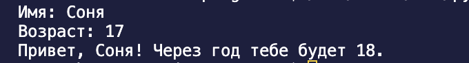

### Задание 2
```python
a = float(input('a: ').replace(',','.'))
b = float(input('b: ').replace(',','.'))
print(f"sum={round(a+b,2)}; avg={round((a+b)/2,2)}")
```
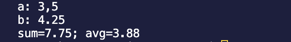

### Задание 3
```python
price = float(input('Введите цену: '))
sale = float(input('Введите скидку: '))
vat =  float(input('Введите НДС: '))
base = price * (1 - sale/100)
print(f"""База после скидки: {base} ₽
НДС:               {base * (vat/100)} ₽
Итого к оплате:    {base * (vat/100) + base} ₽""")
```
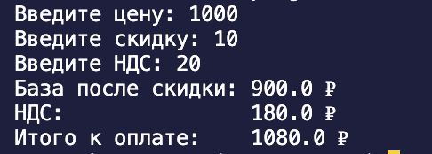

### Задание 4
```python
m = int(input('Минуты: '))
print(f"{m // 60}:{m% 60}")
```


### Задание 5
```python
name = input('Имя: ')
ln = [nam[0] for nam in name.split()]
print('Инициалы:', ''.join(ln))
print('Длина (символов):', len(' '.join(name.split())))
```
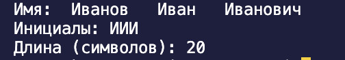

## Лабораторная работа 2

### Задание 1
```python
def min_max(nums: list[float | int]) -> tuple[float | int, float | int]:
    return min(nums), max(nums)
```
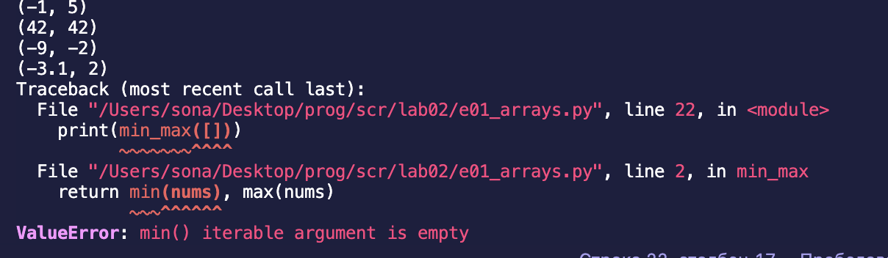

### Задание 2
```python
def unique_sorted(ls: list[float | int]) -> list[float | int]:
    return sorted(set(ls))

```
    
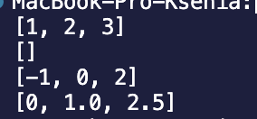


### Задание 3
```python
def flatten(mat: list[list | tuple]) -> list:
    fl = []
    for i in mat:
        if type(i) == list or type(i) == tuple:
            fl.extend(i)
        else:
            raise TypeError
    return fl

```
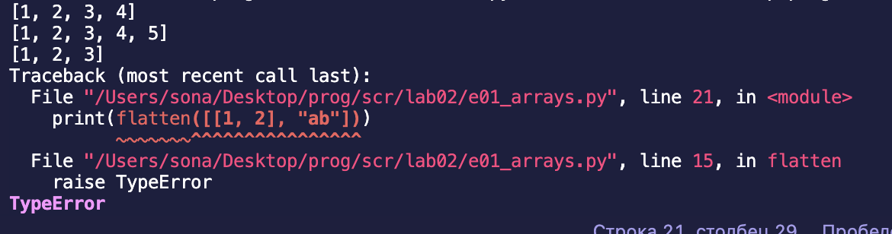

### Задание 4
```python
def transpose(mat: list[list[float | int]]) -> list[list]:
    for i in range(len(mat)-1):
        if len(mat[i]) == len(mat[i+1]):
            continue
        else:
            raise ValueError
    new = []
    if mat == []:
        new = []
    else:
        for i in range(len(mat[0])):
            new_row = []
            for row in mat:
                new_row.append(row[i])
            new.append(new_row)
    return new


```
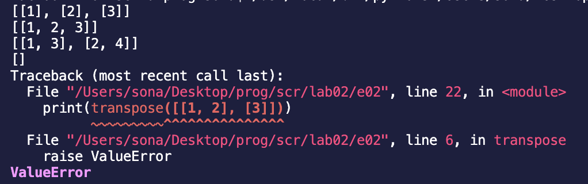


### Задание 5
```python
def row_sums(mat: list[list[float | int]]) -> list[float]:
    for i in range(len(mat)-1):
        if len(mat[i]) == len(mat[i+1]):
            continue
        else:
            raise ValueError
    new = [] 
    for row in mat:
        s = 0
        for i in row:
            if type(i) == float or type(i) == int:
                s += i
            else:
                raise TypeError
        new.append(s)
    return new 
```
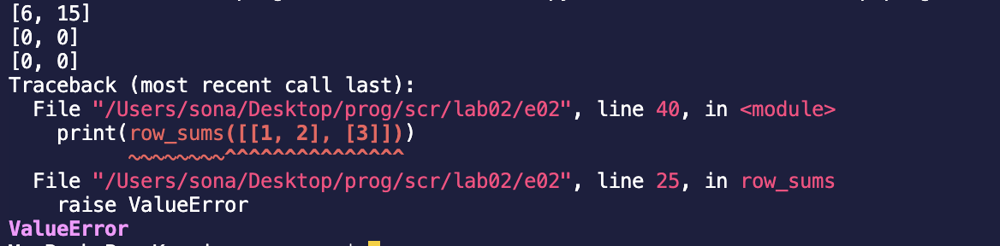

### Задание 6
```python
def col_sums(mat: list[list[float | int]]) -> list[float]:
    for i in range(len(mat)-1):
        if len(mat[i]) == len(mat[i+1]):
            continue
        else:
            raise ValueError
    new = [] 
    for i in range(len(mat[0])):
        s = 0
        for row in mat:
            s += row[i]
        new.append(s)
    return new 
```
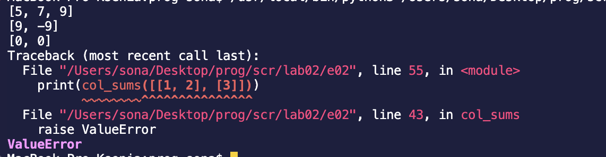

### Задание 7
```python
def format_record(rec: tuple[str, str, float]) -> str:
    if len(rec) == 3:
        fio = rec[0].split()
        if len(fio) == 2:
            fio1 = fio[0] + ' ' + fio[0][0].capitalize() + '.'
        if len(fio) == 3:
            fio1 = fio[0].capitalize() + ' ' + fio[1][0].capitalize() + '.' + fio[2][0].capitalize() + '.'
        if len(fio) < 2:
            raise ValueError
        gr = rec[1]
        gpa = float(rec[2])
        return fio1 + ', гр. ' + gr + ', GPA ' + f"{gpa: .2f}"
    if len(rec) != 3:
        raise ValueError
    if type(rec[0]) != str or type(rec[1]) != str or type(rec[2]) != float:
        raise TypeError
```
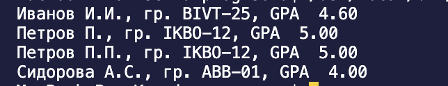

## Лабораторная работа 3

### normalize
```python
def normalize(text: str, *, casefold: bool = True, yo2e: bool = True) -> str:
    if casefold:
        text = text.casefold()
    if yo2e:
        text = text.replace('ё','е')
        text = text.replace('Ё','Е')
    text = text.replace('\t', ' ').replace('\r', ' ').replace('\n', ' ')
    text = ' '.join(text.split())
    text = text.strip()
    return text

```
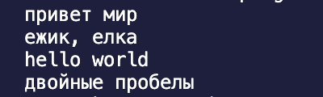

### tokenize
```python
def tokenize(text: str) -> list[str]:
    return re.findall(r'\w+(?:-\w+)*', text)

```
    
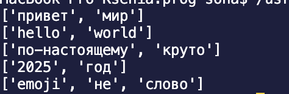


### count_freq + top_n
```python
def count_freq(tokens: list[str]) -> dict[str, int]:
    sl = {}
    for token in tokens:
        if token in sl:
            sl[token] += 1
        else:
            sl[token] = 1 
    return sl 

def top_n(freq: dict[str, int], n: int = 5) -> list[tuple[str, int]]:
    sorted_freq = sorted(freq.items(), key=lambda x: (-x[1], x[0]))
    return sorted_freq[:n]

```
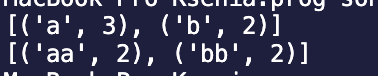

### src/text_stats.py 
```python
import sys
from lib.e01_text import tokenize, count_freq, top_n, normalize

def main():
    try:
        if sys.stdin.isatty():
            print("Ожидание ввода данных...")
            print("Введите текст и нажмите Ctrl+D (Mac/Linux) для завершения ввода:")
        
        text = sys.stdin.read()
        
        if not text.strip():
            print("Нет входных данных")
            return
            
        normalized_text = normalize(text)
        tokens = tokenize(normalized_text)

        if not tokens:
            print("В тексте не найдено слов")
            return

        total_words = len(tokens) # общее количество слов
        freq_dict = count_freq(tokens) # словарь частот
        unique_words = len(freq_dict) # количество уникальных слов 
        top_words = top_n(freq_dict, 5) # самые популярные частоты
        
        print(f"Всего слов: {total_words}")
        print(f"Уникальных слов: {unique_words}")
        print("Топ-5:")
        for word, count in top_words:
            print(f"{word}: {count}")

    except EOFError:
        print("\nВвод завершен")
    except KeyboardInterrupt:
        print("\nПрограмма прервана пользователем")
    except Exception as e:
        print(f"Произошла ошибка: {e}")

if __name__ == "__main__": 
    main()


```
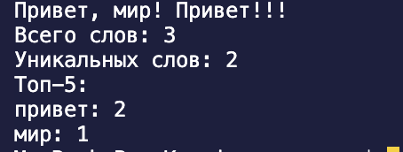


# Лаборторная работа 4
## Задание A — io_txt_csv.py
```python
import csv
from pathlib import Path
from typing import Iterable, Sequence

def read_text(path: str | Path, encoding: str = "utf-8") -> str:
    try:
        return Path(path).read_text(encoding=encoding)
    except FileNotFoundError:
        return "Такого файла нет"
    except UnicodeDecodeError:
        return "Неудалось изменить кодировку"


def write_csv(rows: list[tuple | list], path: str | Path, header: tuple[str, ...] | None = None) -> None:
    p = Path(path)
    with p.open('w', newline="", encoding="utf-8") as file: 
        f = csv.writer(file)
        if header is None and rows == []:
            file_c.writerow(('a', 'b')) 
        if header is not None:
            f.writerow(header)
        if rows != []:
            const = len(rows[0])
            for i in rows:
                if len(i) != const:
                    return ValueError
        f.writerows(rows)

def ensure_parent_dir(path: str | Path) -> None:
    Path(path).parent.mkdir(parents=True, exist_ok=True)

print(read_text(r"/Users/sona/Desktop/prog/scr/data/input.txt"))
write_csv([("word","count"),("test",3)], r"/Users/sona/Desktop/prog/scr/data/check.csv") 
```
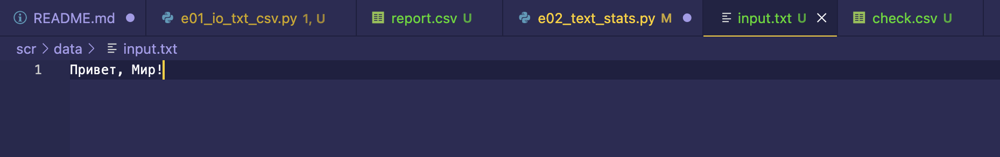
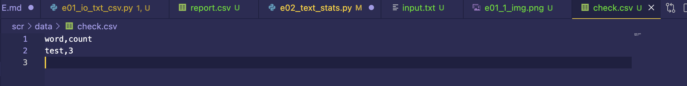


## Задание B — text_report.py
```python
from lib.e01_io_txt_csv import read_text, write_csv, ensure_parent_dir
import sys
from pathlib import Path

sys.path.append(r'/Users/sona/Desktop/prog/scr/lab03/lib')

from lib.e01_text import normalize, tokenize, count_freq, top_n


def exist_path(path_f: str):
    return Path(path_f).exists() #существует ли файл 


def main(file: str, encoding: str = 'utf-8'): 
    if not exist_path(file):
        raise FileNotFoundError 
    
    file_path = Path(file)
    text = read_text(file, encoding=encoding) # текст в одну строку
    norm = normalize(text) 
    tokens = tokenize(norm)
    freq_dict = count_freq(tokens)
    top = top_n(freq_dict, 5)
    top_sort = sorted(top, key=lambda x: (x[1], x[0]), reverse=True) # сортирует список, критерии сортировки, частота слово и само слово, сортировка по убыванию
    report_path = file_path.parent / 'report.csv' # cоздает путь для файла отчета в той же папке, где исходный файл
    write_csv(top_sort, report_path, header=('word', 'count'))
    
    print(f'Всего слов: {len(tokens)}')
    print(f'Уникальных слов: {len(freq_dict)}')
    print('Топ-5:')
    for cursor in top_sort:
        print(f'{cursor[0]}: {cursor[-1]}')


main(r'/Users/sona/Desktop/prog/scr/data/input.txt')
```
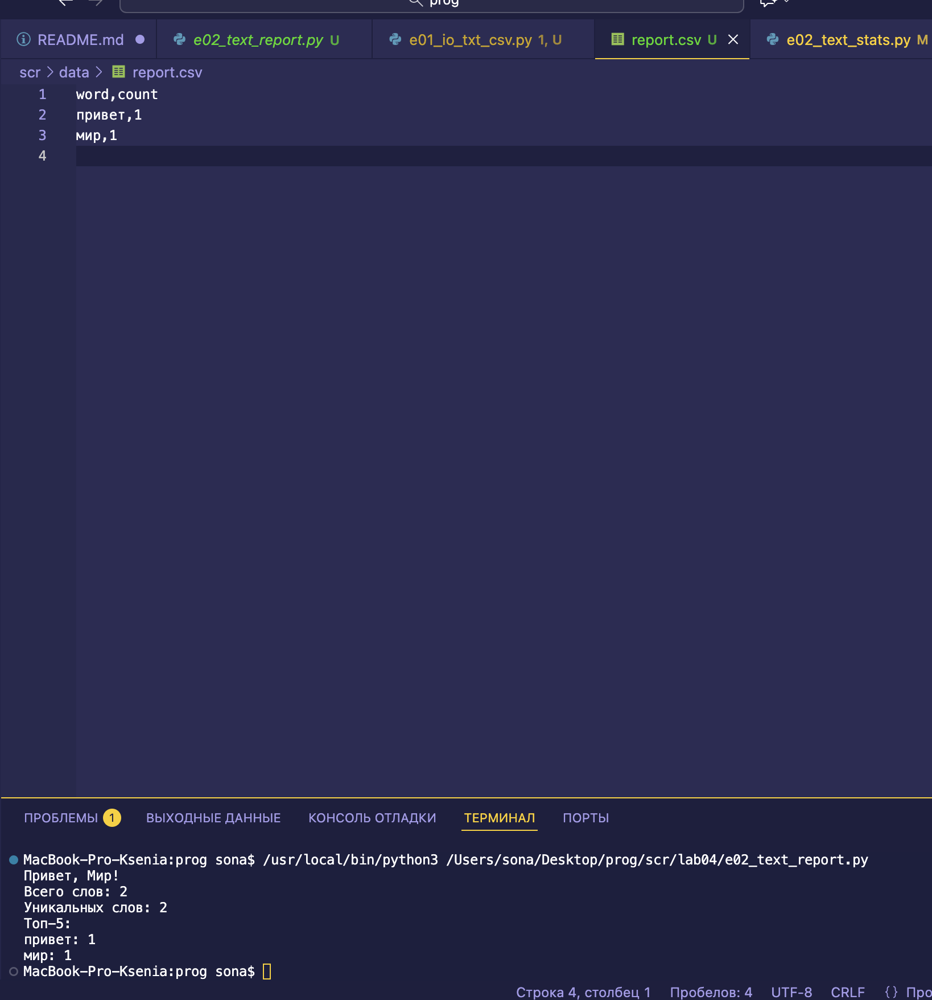
